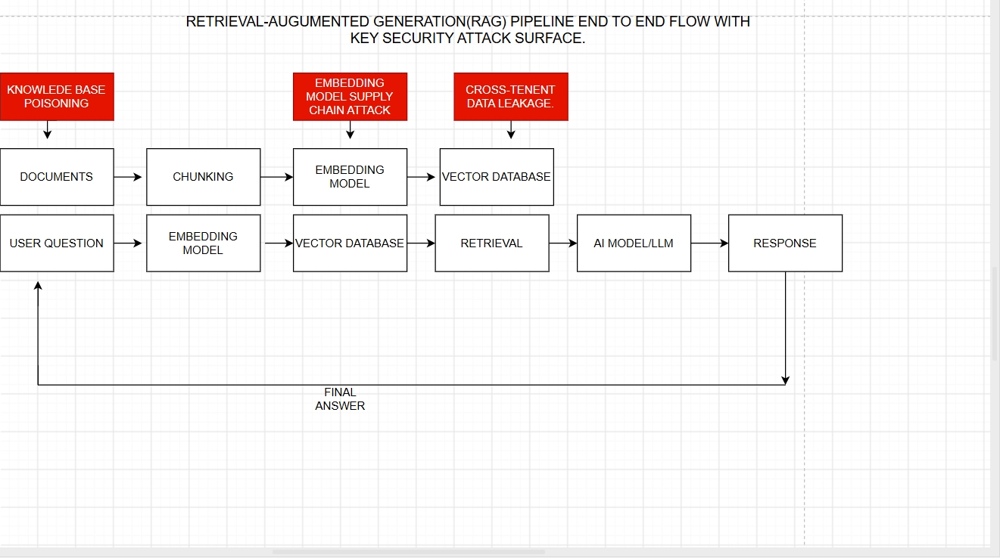

# Week 10 – RAG Pipeline Security

## Vector Data Pipeline Flow Diagram

This diagram shows the end-to-end Retrieval-Augmented Generation (RAG) pipeline and highlights three important security attack surfaces.

### RAG Pipeline

The document processing flow is:

Documents → Chunking → Embedding Model → Vector Database

Documents are first divided into smaller chunks. The chunks are then converted into numerical vector representations by an embedding model and stored in the vector database.

The user query follows a separate retrieval flow:

User Question → Embedding Model → Vector Database → Retrieval → AI Model/LLM → Response

The user's question is converted into an embedding and compared against stored vectors in the vector database. Relevant information is retrieved and provided to the AI model/LLM, which generates the final response.

## Security Attack Surfaces

### 1. Knowledge Base Poisoning

This attack occurs at the document injection point. An attacker could introduce malicious or misleading content into documents that are later processed and stored in the knowledge base.

If the poisoned content is retrieved, it may influence the AI model's response.

### 2. Embedding Model Supply Chain Attack

The embedding model is a security-sensitive component because it converts documents and user questions into vectors.

If the embedding model or its dependencies are compromised, an attacker could manipulate the embedding process and affect retrieval results.

### 3. Cross-Tenant Data Leakage

The vector database is another important security boundary.

If tenant isolation or access controls are improperly implemented, a user's query could retrieve information belonging to another tenant or customer.

This could expose sensitive information across organizational boundaries.

## Security Perspective

The diagram shows that security must be considered throughout the entire RAG pipeline, not only at the AI model.

Important controls include:

- Validating and sanitizing documents before ingestion.
- Protecting the embedding model and its dependencies.
- Enforcing strong tenant isolation in the vector database.
- Applying authentication and authorization to retrieval requests.
- Monitoring retrieval activity for suspicious behavior.
- Treating retrieved content as untrusted data before it reaches the AI model.

## Conclusion

The RAG pipeline connects document ingestion, embeddings, vector storage, retrieval, and AI generation. Each stage introduces different security risks, so protecting the complete pipeline is important for preventing data poisoning, supply-chain attacks, and cross-tenant information leakage.
